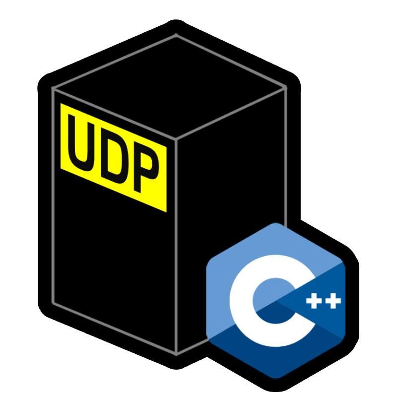

<b>"udpcpp.hpp"</b> is a C++ library especially made to implement UDP communication in your projects. It provides an easy-to-use interface for sending and receiving UDP packets with minimal setup.

Currently the <b>initial version 1.0</b> supports sending & listening only to/form <b>127.0.0.1</b>. The following template is designed to work with only <a href="https://visualstudio.microsoft.com/vs/older-downloads/">Visual Studio 2019</a>. The purpose of <i>localhost-support-only</i> was designed to establish communicaiton between various applicaitons. Future versions of <b>udpcpp.hpp</b> will have power to communicate any hardware or software that supports UDP protocol.

Download <b>udpcpp.hpp</b> <a href="https://drive.google.com/file/d/19bH2PnbeMV1ztyC8UBZ36HehlgtVG70C/view?usp=sharing">here</a>.
